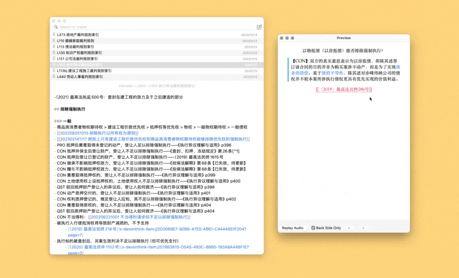

# Jump to… Anki 中的（半）双向链接

半自动的双向链接，连通 Anki 和几乎任何软件。使用[我自定义的摘抄模板]('https://github.com/BlackwinMin/Anki-gallery/tree/master/Template%20-%20Cloze%20for%20Excerpt')。

出现于：
- [Anki 进阶手册：4-3 模板：半桶水的双向链接](https://utgd.net/course/20005/lesson/20068)
- [用 Keyboard Maestro 将几乎任何软件纳入双向链接网络](https://utgd.net/article/20129/)
- [拓展双链网络，在任何位置快速插入双向链接](https://utgd.net/article/21294/)

