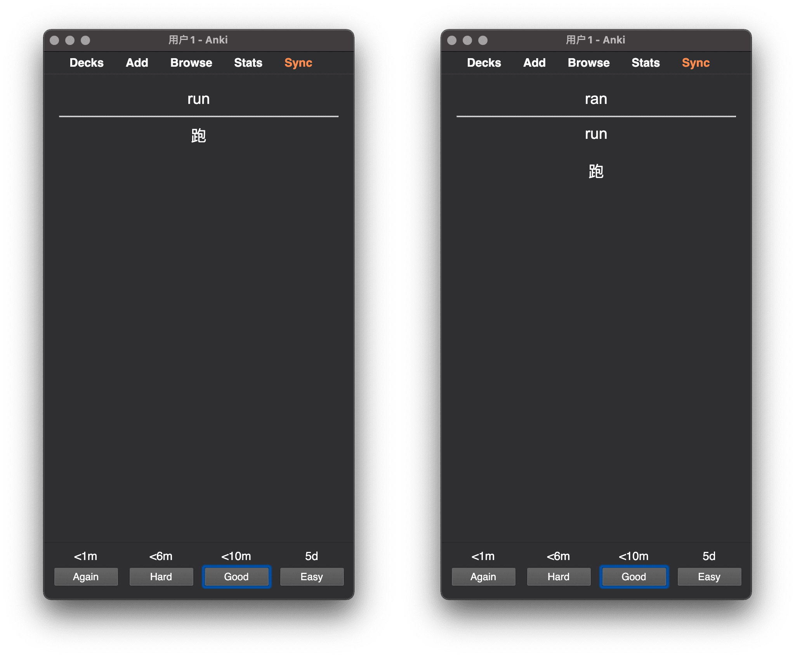

# Template - Basic for Variation

Anki 模板，生成多张卡片，每一张考察不同侧面，辅助成簇记忆，例如：

- 单词、变形和翻译
- 单词、近义词和释义
- 单词、同义词和释义
- 单词、反义词和释义
- 古代语言、原文释义和翻译
- 艺术品图像、作品名称、作者及背景信息
- ……

原文：[Anki 进阶手册：4-4 模板：多面卡片](https://utgd.net/course/20005/lesson/20193)

