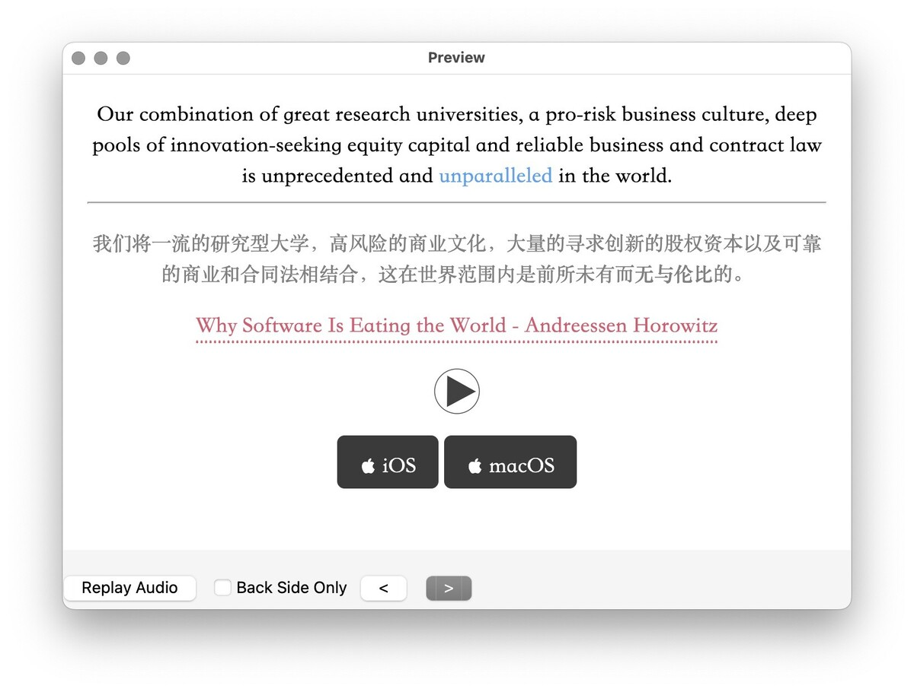

# Template - Basic for Vocabulary

Anki 模板，点击按钮查询当前单词，可自定义 URL Scheme。内置 iOS 查词和 macOS 查词。

在 iOS 上使用时，需安装[配套查单词 Shortcuts 动作](https://www.icloud.com/shortcuts/0d3e0429d865443aa71491a75891c8fd)。当然，你也可以长按目标单词后，在原生上下文菜单中选择“Look up”查看词典。

原文：[Anki 进阶手册：2-2 跳转查词](https://utgd.net/course/20005/lesson/20058)。