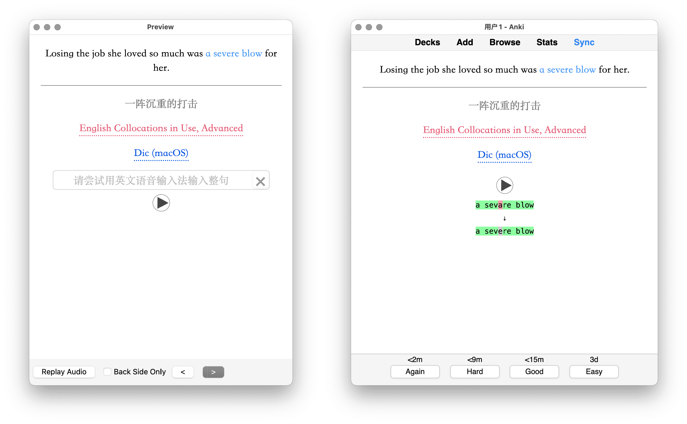

# Template - Basic for Vocabulary

Anki 模板，用于学习单词或词组。点击按钮查询当前单词，可自定义 URL Scheme。重点单词在例句中会高亮显示，不过暂时无法照顾非简单增加后缀的变形（你不要选这种例句啊！）。

20260514 更新：增加了一种卡片类型，供练习听写，可逐个字母检查拼写。美化样式。

20260507 更新：增加输入框，提示通过语音输入法朗读句子，确保发音准确。移除 iOS 查词功能，因为长按单词后 Look up 更快且无痕，已无必要保留。美化样式。

<del>在 iOS 上使用时，需安装[配套查单词 Shortcuts 动作](https://www.icloud.com/shortcuts/0d3e0429d865443aa71491a75891c8fd)。当然，你也可以长按目标单词后，在原生上下文菜单中选择“Look up”查看词典。</del>

出现于：
- [Anki 进阶手册：2-2 跳转查词](https://utgd.net/course/20005/lesson/20058)。
- [Anki 进阶手册：2-6 在 Anki 里练外语发音](https://utgd.net/course/20005/lesson/20192)