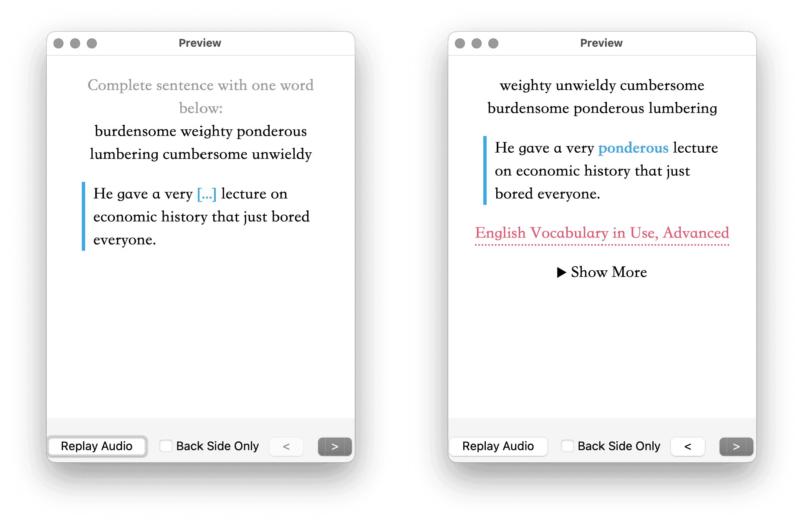
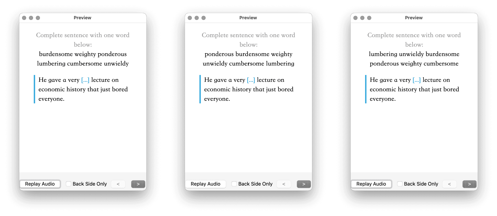

# Template - Cloze for MCQ 选择题模板

基于完形填空形式的轻量化选择题模板，包含原文、出处、链接、（半）双向链接和备注等信息。

MCQ 即 multiple choice questions，通常对应中文中的“单选题”，如果确实需要多选，或不定向选择，直接在完形 Field 后面备注就好，这样一个模板就能搞定单选、多选和不定向选择等多种题型。问题 Field 中存储待选项，完形填空 Field 中存储例句。

每次显示题目时，选项顺序都会随机打乱，避免背题、记忆僵化，思路可参阅[《Anki 进阶手册：6-3 浅层模式匹配》](https://utgd.net/course/20005/lesson/20196)）。

